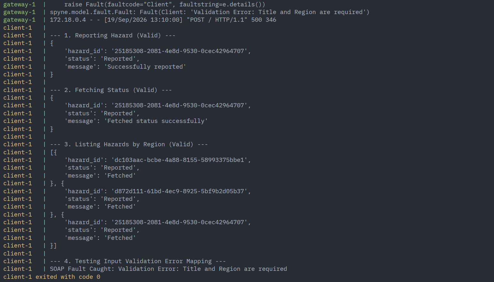

# Civic Hazard Reporting System: SOAP-to-gRPC Gateway

## Architecture & Critical Components

*   **Protocol Buffers (`hazard/hazard.proto`)**: This defines the gRPC service contract, including the exact request and response schemas for all hazard operations.
*   **Generated Stubs (`src/hazard/`)**: Contains the compiled Python code (`hazard_pb2.py` and `hazard_pb2_grpc.py`) generated from the proto file. The directory acts as an initialized Python module allowing the server and gateway to easily import the gRPC mechanics.
*   **gRPC Backend Server (`src/server.py`)**: The modern backend running internally on port `50051`. It maintains the in-memory database and processes the core logic for the `ReportHazard`, `GetHazardStatus`, and `ListHazards` operations, enforcing strict input validation.
*   **Translating Gateway (`src/gateway.py`)**: A Spyne-powered middleware web server running on port `8000`. It exposes a legacy SOAP 1.1 interface (`/?wsdl`), receives XML payloads, translates them into Protobuf messages, and routes them to the gRPC backend. It is also responsible for catching gRPC validation errors and mapping them to standard SOAP Faults.
*   **Legacy SOAP Client (`src/client.py`)**: A testing script utilizing the `zeep` library to simulate an external legacy system interacting with the gateway. It executes sequentially to verify all API endpoints and error handling mechanisms.

## Start server, gateway and client

```bash
docker compose up
```

Server and the gateway will be started as long running containers while the client will be run once and exit.


